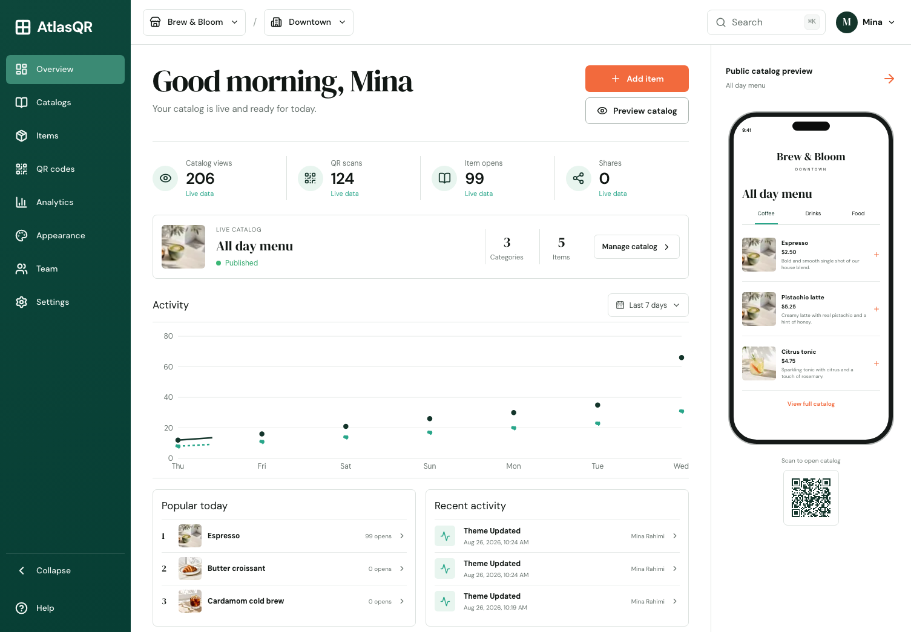

# AtlasQR

AtlasQR is a multi-tenant SaaS foundation for QR menus, digital catalogs, service lists, price lists, and location-aware public business content. It includes a production-oriented web app, API, background worker, PostgreSQL schema, dynamic QR resolver, multilingual public catalog, analytics pipeline, RBAC, audit trail, entitlements, and local infrastructure.



## What is implemented

- Email/password registration and sign-in with Argon2id, opaque hashed sessions, secure cookies, CSRF checks, rate limits, and session revocation.
- Organization, business, business-type, branch, catalog, category, item, translation, variant, availability, theme, campaign, QR, analytics, plan, entitlement, membership, audit, outbox, API-key, webhook, notification, and domain data models.
- Four-step onboarding that creates and publishes a real tenant-scoped catalog and dynamic QR code.
- Owner dashboard backed by persisted metrics, activity, catalogs, items, QR codes, team membership, and themes.
- Public catalogs with SSR metadata, structured data, search, categories, availability filters, favorites, sharing, item detail and variants, branch/room/table context, translated content, RTL, PWA caching, and honest offline state.
- Dynamic non-guessable QR tokens whose destination can change without reprinting, with scan events processed asynchronously.
- PostgreSQL migrations, tenant indexes, row-level security policies, seed fixtures, unit/domain tests, desktop/mobile Playwright tests, and CI.

See [requirements traceability](docs/requirements-traceability.md) for exact coverage and provider-gated capabilities.

## Stack

- Node.js 22+, pnpm 10, TypeScript, Turborepo
- Next.js 16, React 19, Tailwind CSS 4, TanStack Query, Recharts
- NestJS 11 with Fastify, OpenAPI, Zod contracts
- PostgreSQL 17 with Drizzle ORM and RLS hardening
- Redis 8, BullMQ, MinIO-compatible storage and SMTP-ready local services
- Vitest and Playwright

## Quick start

```bash
corepack enable
pnpm install --frozen-lockfile
cp .env.example .env
docker compose up -d postgres redis
pnpm db:migrate
pnpm db:seed
pnpm dev
```

Default URLs:

- Web: `http://localhost:3000`
- API: `http://localhost:4000/api/v1`
- Health: `http://localhost:4000/health/ready`
- OpenAPI UI: `http://localhost:4000/docs`

Seeded demo:

- Email: `mina@atlasqr.local`
- Password: `AtlasDemo!2026`
- Public catalog: `/b/brew-bloom/all-day-menu?branch=downtown`
- QR resolver: `/q/BrewBloomQR2026DemoToken`

The checked-in `.env.example` uses ports 3000/4000. This workspace currently uses 3100/4100 in its ignored `.env` because other local applications occupy the defaults.

## Verification

```bash
pnpm typecheck
pnpm lint
pnpm test
pnpm build
pnpm test:e2e
```

The browser suite expects PostgreSQL, Redis, the API, worker, and web app to be running with seeded data.

## Repository map

```text
apps/web       Next.js owner dashboard and public catalog
apps/api       NestJS/Fastify REST API and QR resolver
apps/worker    BullMQ/outbox analytics worker
packages/contracts  Shared Zod schemas and API types
packages/database   Drizzle schema, migrations, and seed
docs           Prompt, architecture, security, runbook, and traceability
```

## Documentation

- [Optimized implementation prompt](docs/master-implementation-prompt-v2.md)
- [Architecture](docs/architecture.md)
- [API guide](docs/api.md)
- [Security model](docs/security.md)
- [Operations runbook](docs/runbook.md)
- [Requirements traceability](docs/requirements-traceability.md)
- [Design fidelity ledger](docs/design/fidelity-ledger.md)

## Production notes

Rotate every secret, use a managed PostgreSQL/Redis/object-storage stack, enforce TLS, run migrations as a release job, place the API behind a trusted proxy/WAF, configure backups and observability exporters, and connect explicit email, storage, billing, and custom-domain adapters before enabling those provider-backed UI actions.
